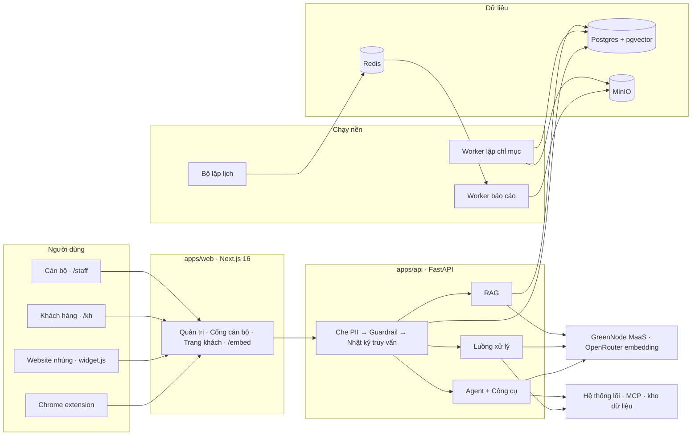

# MSB Knowledge Assistant

> Trợ lý tri thức nội bộ cho ngân hàng. Cán bộ hỏi quy trình, quy định, sản phẩm và nhận câu trả lời
> **trích dẫn tới đúng Điều/Khoản của văn bản còn hiệu lực**. Trợ lý tra được dữ liệu trên hệ thống
> lõi, lập báo cáo và biểu mẫu, xuất Excel. Khách hàng hỏi qua trang công khai hoặc bong bóng chat
> nhúng trên website. Compliance có nhật ký đầy đủ từng lượt hỏi.
>
> **Bài dự thi MSB AI Hackathon.** Mô hình chạy trên **GreenNode MaaS (VNG Cloud AI Platform)**.
> Toàn bộ tài liệu demo là **dữ liệu mô phỏng**, không có một dòng dữ liệu thật nào của MSB.

| | |
|---|---|
| **Demo** | https://59-153-246-116.sslip.io — tài khoản trong [`docs/SUBMISSION.md`](docs/SUBMISSION.md) |
| **Kịch bản demo 10 phút** | [`docs/DEMO_SCRIPT.md`](docs/DEMO_SCRIPT.md) |
| **Kiến trúc chi tiết** | [`docs/ARCHITECTURE.md`](docs/ARCHITECTURE.md) |
| **Nội dung pitch** | [`docs/PITCH_DECK.md`](docs/PITCH_DECK.md) |
| **Chạy trên Windows** | [`docs/SETUP_WINDOWS.md`](docs/SETUP_WINDOWS.md) |

---

## 1. Bài toán

Một cán bộ quan hệ khách hàng cần biết "hồ sơ này đủ điều kiện giải ngân chưa" phải mở vài văn bản
hàng trăm trang, tự đối chiếu xem bản nào còn hiệu lực, rồi mở tiếp hệ thống BPM xem hồ sơ đang ở
bước nào. Hỏi đồng nghiệp thì nhanh nhưng không để lại vết. Dùng ChatGPT thì nhanh nhưng nó không
đọc được văn bản nội bộ, không biết hồ sơ HS2026-0412 là gì, và đưa dữ liệu khách hàng ra ngoài.

Ba ràng buộc khiến bài toán này không giải được bằng một chatbot thông thường:

1. **Phải trích dẫn được.** Trả lời sai một điều kiện giải ngân là rủi ro tín dụng thật. Mỗi câu
   trả lời phải chỉ rõ Điều nào, văn bản nào, phiên bản nào, hiệu lực từ ngày nào.
2. **Phải phân quyền theo đơn vị.** Văn bản của Khối Khách hàng Doanh nghiệp không được rò sang
   Khối Vận hành; trang khách hàng chỉ được đọc kho công khai.
3. **Phải kiểm toán được.** Compliance cần biết ai hỏi gì, hệ thống trả lời gì, dựa trên văn bản
   nào, cán bộ đánh giá ra sao.

## 2. Giải pháp

Nền tảng trợ lý tri thức đa đơn vị, chạy trong hạ tầng ngân hàng, gồm bốn lớp:

| Lớp | Nội dung |
|---|---|
| **Tri thức** | Kho theo đơn vị → văn bản (PDF/DOCX/TXT) có loại, phiên bản, ngày hiệu lực → cắt đoạn **theo Chương/Mục/Điều** → vector trong pgvector |
| **Trả lời** | RAG có guardrail tiếng Việt, hoặc luồng xử lý tự thiết kế trên canvas, hoặc agent gọi công cụ |
| **Hành động** | Công cụ gọi API lõi, MCP server, tính toán nghiệp vụ; lập báo cáo, điền biểu mẫu, xuất Excel; thao tác ghi dừng chờ cán bộ duyệt |
| **Kiểm soát** | Che PII trước khi tới mô hình, bộ lọc rò rỉ prompt, nhật ký truy vấn, đo token theo từng thành phần |

Trợ lý đến với người dùng qua **năm mặt tiếp xúc**, dùng chung một lõi và một nhật ký:

```
Cổng cán bộ /staff · Trang khách hàng /kh · Bong bóng nhúng website · Chrome extension · Bong bóng vận hành trong trang quản trị
```

## 3. Tính năng

| Nhóm | Chi tiết | Ở đâu |
|---|---|---|
| **Kho tri thức** | Nhiều kho theo đơn vị; tải PDF/DOCX/TXT kèm loại văn bản, phiên bản, ngày hiệu lực; bật/tắt từng văn bản cho AI | Quản trị → Kho tri thức |
| **Trích dẫn theo Điều** | Cắt đoạn nhận biết `Chương / Mục / Điều`, mỗi đoạn mang breadcrumb; câu trả lời gắn `[#n]` tới đúng Điều và ngày hiệu lực | `worker/pipeline/chunker.py` |
| **Trợ lý** | Cho cán bộ (JWT) hoặc khách hàng (khoá công khai); gắn nhiều kho hoặc một luồng xử lý; logo riêng; phạm vi theo đơn vị hoặc toàn ngân hàng | Quản trị → Trợ lý |
| **Luồng xử lý** | Canvas React Flow, runtime tự viết: phân loại ý định → chọn kho → soạn prompt → trả lời; có node gọi công cụ và xuất tài liệu | Quản trị → Luồng xử lý |
| **Công cụ (agent)** | 4 loại: API nội bộ, tính toán dựng sẵn, MCP server, xuất Excel; thao tác ghi **dừng chờ duyệt**; mọi lần gọi vào nhật ký | Quản trị → Công cụ |
| **Báo cáo & lịch chạy** | Luồng báo cáo xuất Markdown/DOCX/XLSX, chạy nền; đặt lịch cron theo giờ Việt Nam, gửi theo chức danh | Quản trị → Lịch chạy · Cán bộ → Báo cáo của tôi |
| **Biểu mẫu** | Cán bộ điền, hệ thống điền sẵn từ hệ thống lõi, AI soạn phần tự luận, xuất .docx; trường PII không bao giờ tới mô hình | Quản trị → Biểu mẫu · Cán bộ → Biểu mẫu |
| **Xuất Excel bất kỳ** | Bảo trợ lý "xuất cái này ra Excel", nó dựng .xlsx từ đúng nội dung hội thoại, không cần dựng báo cáo trước | Công cụ `xuat_excel` |
| **Bong bóng nhúng** | Một thẻ `<script>` là website nội bộ hay đối tác có bong bóng chat; chỉ website được duyệt mới nhúng được, trình duyệt cưỡng chế bằng CSP | Trợ lý → tab Nhúng vào website |
| **Chrome extension** | Bong bóng trôi nổi kéo thả trên mọi trang, kèm Side Panel; đăng nhập một lần; tự chọn trợ lý theo tên miền; bôi đen chữ rồi hỏi | [`apps/extension`](apps/extension/README.md) |
| **Kỹ năng** | Bí kíp nghiệp vụ trợ lý nạp **khi cần**: luôn thấy tên và mô tả của mọi kỹ năng, chỉ đọc toàn văn kỹ năng khớp câu hỏi. Xuất nhập được theo chuẩn mở Agent Skills | Quản trị → Kỹ năng |
| **Bộ nhớ cá nhân** | Trợ lý nhớ cách từng cán bộ làm việc để trả lời hợp hơn, và **không bao giờ** nhớ thông tin khách hàng hay nội dung quy định. Cán bộ tự xem, sửa, xoá | Cán bộ → Trợ lý nhớ gì về tôi |
| **Trợ lý Vận hành** | Bong bóng trong trang quản trị: hỏi cách vận hành hệ thống và nhận trả lời có trích dẫn; mô tả bằng tiếng Việt thì nó dựng luồng xử lý nháp, người dùng bấm nút mới tạo | Bong bóng góc màn hình · Quản trị → Trợ lý Vận hành |
| **Nhật ký truy vấn** | Ai hỏi gì, trả lời gì, trích dẫn nào, độ trễ, 👍/👎 kèm lý do, kênh nào, trang nào | Quản trị → Nhật ký truy vấn |
| **Đo token** | Mỗi lượt gọi mô hình ghi một dòng: thành phần, kênh, đơn vị, trợ lý, số token, model | Quản trị → Token sử dụng |

## 4. Chạy thử

Cần Docker Desktop, Python 3.11+, Node 20+. Windows xem [`docs/SETUP_WINDOWS.md`](docs/SETUP_WINDOWS.md).

```bash
# 1. Hạ tầng — postgres+pgvector :5432, redis :6390, minio :9010 (console :9011)
cd infra/docker && cp .env.example .env && docker compose up -d && docker compose ps

# 2. Biến môi trường dùng chung (API và worker đều đọc file này)
cd ../.. && cp .env.example .env

# 3. API
cd apps/api && python -m venv .venv && source .venv/bin/activate
pip install -e ".[dev]"
python -m spacy download en_core_web_sm        # tokenizer cho Presidio (che PII)
alembic upgrade head
uvicorn app.main:app --reload --port 8000      # kiểm tra: curl localhost:8000/health

# 4. Khai báo mô hình — Quản trị → Cài đặt AI, hoặc đặt sẵn SEED_* trong .env
#    LLM      : GreenNode MaaS · google/gemma-4-31b-it
#    Embedding: OpenRouter · openai/text-embedding-3-small (1536 chiều)

# 5. Dữ liệu demo (chạy lại nhiều lần được)
python -m app.seed_demo
python -m app.seed_ops                         # trợ lý vận hành + cẩm nang cho quản trị viên
python -m app.seed_skills                      # bốn kỹ năng nghiệp vụ mẫu

# 6. Worker lập chỉ mục (cần provider embedding đang bật)
cd ../worker && python -m venv .venv && .venv/bin/pip install -r requirements.txt
./scripts/start.sh

# 7. Web
cd ../web && npm install && npm run dev        # http://localhost:3000
```

Bật thêm nếu muốn xem báo cáo, biểu mẫu, công cụ:

```bash
cd apps/api && .venv/bin/python -m app.jobs.worker   # chạy nền báo cáo / biểu mẫu
cd apps/api && .venv/bin/python -m app.scheduler     # bộ lập lịch cron
./scripts/mock-core.sh        # hệ thống lõi mô phỏng     :8095
./scripts/mock-mcp.sh         # MCP quản trị rủi ro       :8096
./scripts/mock-dwh.sh         # kho dữ liệu báo cáo (MCP) :8097
./scripts/demo-site.sh        # website demo để thử nhúng :8090
```

Sau khi seed có sẵn: **4 đơn vị · 5 kho tri thức · 30 văn bản mô phỏng · 10 cán bộ · 12 trợ lý ·
25 công cụ (20 nghiệp vụ + 5 công cụ báo cáo) · 7 luồng xử lý (2 hội thoại + 5 báo cáo Excel có biểu đồ) ·
5 lịch chạy · 4 biểu mẫu · 9 kỹ năng**. Tài khoản in ra ở cuối lệnh seed. Lệnh `seed_ops` thêm
một đơn vị ẩn, kho **Cẩm nang vận hành** 15 tài liệu và **Trợ lý Vận hành** cho quản trị viên.

Muốn về đúng bộ demo chuẩn (xoá hội thoại thử, đơn vị tạo tay, tệp đã tải lên), chạy
`python -m app.reset_demo --yes`: xoá mọi dữ liệu nghiệp vụ **trừ khoá AI**, rồi seed lại cả ba lệnh.
Trên server: `deploy/remote.sh reset-demo` (pg_dump trước khi xoá).

## 5. Kiến trúc



Chi tiết từng lớp, quyết định thiết kế và các bẫy đã gặp: [`docs/ARCHITECTURE.md`](docs/ARCHITECTURE.md).

## 6. An toàn

Bốn lớp, đều ở mức mã nguồn nên không phụ thuộc vào việc mô hình có "ngoan" hay không:

| Lớp | Làm gì |
|---|---|
| **Che PII** | Microsoft Presidio cộng bộ nhận dạng tiếng Việt: CCCD, CMND, số tài khoản, CIF, OTP, số điện thoại. Chạy trước khi câu hỏi tới mô hình, tới bộ nhớ hội thoại và tới nhật ký. Số tiền, ngày tháng, số hiệu văn bản giữ nguyên |
| **Chống tiêm prompt** | Đoạn văn bản và kết quả công cụ được bọc trong khối dữ liệu `<<<TÀI LIỆU n>>>`; ảnh và HTML bị lọc; prompt nói rõ đó là dữ liệu chứ không phải mệnh lệnh |
| **Bộ lọc đầu ra** | Giữ lại 160 ký tự cuối của luồng, phát hiện dấu hiệu lộ system prompt thì cắt và ghi trạng thái `blocked` |
| **Phân quyền** | Trợ lý khách hàng chỉ gắn được kho công khai; cán bộ chỉ thấy trợ lý đơn vị mình hoặc trợ lý mở toàn ngân hàng; công cụ cần duyệt không bao giờ xuất hiện ở kênh khách hàng |

Kiểm chứng bằng `scratch/redteam.py`: 22 kịch bản tấn công thật, gồm tiêm prompt trực tiếp, mã hoá,
nhiều lượt, qua văn bản, qua endpoint công cụ độc hại, đòi lộ system prompt, dụ nhắc lại PII, rò
sang đơn vị khác, SSRF qua tham số công cụ, vượt bước duyệt. **22/22 chặn được.**

## 7. Kiểm thử

Các con số dưới đây là kết quả chạy thật, không phải ước lượng. **16 trong 19 bộ chạy thẳng vào bản
deploy** `https://59-153-246-116.sslip.io`; hai bộ đánh dấu ✱ cần gọi trực tiếp hệ thống lõi mô phỏng
nên chạy trên máy cục bộ.

| Bộ | Kiểm tra | Kết quả |
|---|---|---|
| `scratch/e2e.py` | Toàn tuyến: lập chỉ mục → trích dẫn → guardrail → nhúng → logo → thử nghiệm → luồng → nhật ký | 67/67 |
| `scratch/redteam.py` ✱ | Tấn công đối kháng | 22/22 |
| `scratch/smoke_tools.py` ✱ | Công cụ, SSRF, phạm vi đơn vị, agent, duyệt thao tác | 39/39 |
| `scratch/smoke_ops.py` | Trợ lý Vận hành: phân quyền cấu hình, trích dẫn cẩm nang, soạn luồng rồi chạy thật luồng đó | 39/39 |
| `scratch/smoke_skills.py` | Kỹ năng: chuẩn mã, chấm mô tả, cảnh báo chồng chéo, kích hoạt, xuất nhập SKILL.md | 42/42 |
| `scratch/smoke_memory.py` | Bộ nhớ: ba lớp chặn khi bị tấn công, đọc lại, cách ly giữa cán bộ, hai công tắc | 32/32 |
| `scratch/smoke_export.py` | Xuất Excel từ hội thoại, ép kiểu số, chặn công thức | 36/36 |
| `scratch/smoke_forms.py` | Biểu mẫu, điền sẵn, AI soạn không thấy PII, xuất .docx | 32/32 |
| `scratch/smoke_schedules.py` | Cron, bộ lập lịch, chạy ngay, gửi theo chức danh | 28/28 |
| `scratch/smoke_reports.py` | Luồng báo cáo đầu cuối | 25/25 |
| `scratch/smoke_extension.py` | Kênh extension, lọc trợ lý, chặn 403, nhật ký | 25/25 |
| `scratch/smoke_xlsx_report.py` | MCP kho dữ liệu → Excel nhiều sheet | 20/20 |
| `scratch/smoke_apps_staff.py` | Ràng buộc đối tượng trợ lý, danh sách và chat của cổng cán bộ | 20/20 |
| `scratch/smoke_doc_enabled.py` | Tắt văn bản thì mọi đường trả lời ngừng dùng | 19/19 |
| `scratch/smoke_usage.py` | Đo token theo thành phần | 18/18 |
| `scratch/smoke_app_datasets.py` | Một trợ lý nhiều kho tri thức | 17/17 |
| `scratch/smoke_audit.py` | Mọi kênh đều sinh run, đánh giá, phạm vi xem nhật ký | 15/15 |
| `scratch/smoke_chat_reports.py` | Xin báo cáo trong chat, hộp báo cáo riêng từng cán bộ | 14/14 |
| `apps/api/tests/` | Đơn vị: che PII, quy tắc luồng, đặc tả node, sinh luồng, bộ chặn bộ nhớ, an toàn Excel | 174 ca (che PII, quy tắc luồng, đặc tả node, sinh luồng, bộ chặn bộ nhớ, an toàn Excel, biểu đồ) |
| `apps/web/e2e/` | Trình duyệt thật: quản trị, cán bộ, khách hàng, nhúng, công cụ, báo cáo, extension, bong bóng vận hành, kỹ năng và bộ nhớ | 7 spec |

```bash
cd apps/api && pytest tests/ -q && ruff check app/
cd apps/web && npx tsc --noEmit && npm run build && npx playwright test
cd apps/api && source .venv/bin/activate && python ../../scratch/e2e.py
```

Trỏ bộ kiểm thử vào hệ thống khác: `API=https://<domain> ADMIN_PASSWORD=... python scratch/<tên>.py`.
Hai bộ ✱ còn cần gọi thẳng hệ thống lõi mô phỏng để đối chiếu dữ liệu trước và sau, nên phải chạy ở nơi
mở được cổng 8095.

## 8. Cấu trúc thư mục

```
.
├── apps/
│   ├── api/                  # FastAPI — 125 endpoint, 25 bảng, 28 migration
│   │   ├── app/routers/      # auth, datasets, documents, apps, workflows, tools, artifacts,
│   │   │                     # schedules, forms, staff_auth, public_chat, audit, usage
│   │   ├── app/services/     # chat (guardrail, streaming), retrieval, agent_runtime (LangGraph),
│   │   │                     # workflow_runtime, tools/, reports, forms, pii, guard, usage
│   │   ├── alembic/          # migration 0001 … 0030
│   │   ├── seed_data/docs/   # 30 văn bản nghiệp vụ mô phỏng (EB, RB, Vận hành, Pháp chế)
│   │   └── seed_data/ops/    # 12 tài liệu cẩm nang vận hành, kiến thức của Trợ lý Vận hành
│   ├── worker/               # RQ worker: tải → bóc tách → cắt theo Điều → embed → pgvector
│   ├── web/                  # Next.js 16: quản trị, cổng cán bộ, trang khách, trang nhúng
│   └── extension/            # Chrome extension MV3: bong bóng trôi nổi + Side Panel
├── demo-mock/                # hệ thống lõi :8095, MCP rủi ro :8096, kho dữ liệu :8097 (mô phỏng)
├── demo-site/                # website ngân hàng mô phỏng để thử bong bóng nhúng
├── deploy/                   # deploy.sh + remote.sh + compose production + Caddy
├── infra/docker/             # postgres+pgvector, redis, minio
├── scratch/                  # 19 bộ kiểm thử chạy thật bằng httpx
└── docs/                     # SUBMISSION · DEMO_SCRIPT · ARCHITECTURE · PITCH_DECK · SETUP_WINDOWS
```

Khoảng **36.600 dòng** mã nguồn: 21.700 Python, 14.900 TypeScript/TSX, tính cả bộ kiểm thử
trong `scratch/` và các hệ thống mô phỏng trong `demo-mock/`.

## 9. Cấu hình

Mọi thứ đọc từ `.env` ở thư mục gốc, mẫu ở `.env.example`.

| Biến | Ý nghĩa |
|---|---|
| `DATABASE_URL`, `REDIS_URL`, `MINIO_*` | Hạ tầng |
| `ENCRYPTION_KEY` | Khoá Fernet mã hoá API key của provider khi lưu xuống DB |
| `SEED_LLM_*`, `SEED_EMBEDDING_*` | Để `seed_demo` tạo sẵn provider (tên provider, model, key, base URL) |
| `TOOL_INTERNAL_ALLOWLIST` | Host nội bộ mà công cụ được phép gọi, ngoại lệ hẹp của bộ chặn SSRF |
| `PII_ENGINE` | `presidio` mặc định · `regex` dự phòng · `off` không dùng ở production |
| `PUBLIC_RATE_LIMIT_*`, `STAFF_RATE_LIMIT_*` | Giới hạn tần suất cho kênh công khai, nhúng và cán bộ |
| `ENABLE_CODE_EXECUTE`, `HTTP_REQUEST_ALLOW_PRIVATE`, `ENABLE_MCP_STDIO` | Ba công tắc nguy hiểm, mặc định tắt hết |

## 10. Công nghệ

| Thành phần | Dùng gì |
|---|---|
| Web | Next.js 16 · React 19 · Tailwind v4 · @xyflow/react · react-markdown |
| API | FastAPI · async SQLAlchemy · Alembic |
| Vector | Postgres 16 + pgvector (1536 chiều, cosine) |
| Lưu file | MinIO (tương thích S3) |
| Hàng đợi | Redis + RQ |
| Mô hình | **GreenNode MaaS (VNG Cloud)** cho LLM; OpenRouter cho embedding; hỗ trợ sẵn OpenAI, Gemini, Anthropic và mọi gateway OpenAI-compatible |
| Agent | LangGraph (StateGraph, ToolNode, interrupt, checkpointer Postgres) · langchain-mcp-adapters |
| Che PII | Microsoft Presidio · spaCy · phonenumbers |
| Extension | Manifest V3 · Vite · React, dùng lại khung chat của web |
| Kiểm thử | Playwright · httpx |

---

**Về dữ liệu.** Bảy văn bản trong `apps/api/seed_data/docs/` do nhóm tự viết theo văn phong nghiệp
vụ MSB (EB/RB, RM → CCO1 → CCO2, trạng thái STEB, TSBĐ, TTR/MT103). Ba hệ thống trong `demo-mock/`
sinh số liệu giả. **Không có dữ liệu thật của MSB, TNTalent hay TNEX trong repo này.**
