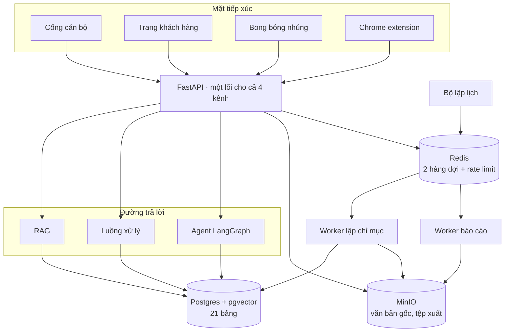

# Kiến trúc

Tài liệu này giải thích hệ thống chạy thế nào và **vì sao** chọn như vậy. Phần quy ước dành cho
người viết code nằm ở `CLAUDE.md`; phần chạy thử nằm ở `README.md`.

## 1. Toàn cảnh

Bốn tiến trình, một cơ sở dữ liệu, một kho object, một hàng đợi.

| Tiến trình | Vai trò | Vì sao tách riêng |
|---|---|---|
| `apps/api` (FastAPI) | Toàn bộ nghiệp vụ, streaming SSE | Một nơi duy nhất quyết định quyền và ghi nhật ký |
| `apps/worker` | Lập chỉ mục văn bản | Bóc tách PDF tốn CPU, không được làm nghẽn request |
| `apps/api` jobs worker | Chạy báo cáo, biểu mẫu | Báo cáo mất hàng chục giây, không thể chạy trong request |
| `apps/api` scheduler | Đến giờ thì xếp việc | Tách khỏi API để restart API không mất lịch |



## 2. Ba tầng danh tính

Đây là quyết định nền tảng: **không gộp cán bộ và quản trị viên vào một bảng người dùng.**

| Tầng | Bảng | Xác thực | Phạm vi |
|---|---|---|---|
| Quản trị viên | `users` + `user_workspaces` | JWT + header `X-Workspace-Id` | `viewer` < `editor` < `owner`; super admin xuyên đơn vị |
| Cán bộ | `employees` | JWT riêng, `role=staff` | Chỉ trợ lý của đơn vị mình, cộng trợ lý mở toàn ngân hàng |
| Khách hàng | không có tài khoản | Khoá công khai của trợ lý, nằm trong **fragment** của URL | Chỉ trợ lý `audience=customer` đã công bố |

Khoá khách hàng đặt sau dấu `#` để trình duyệt không gửi lên máy chủ, nên **không bao giờ vào log
truy cập**. Cán bộ và quản trị viên là hai tập người khác nhau với vòng đời tài khoản khác nhau,
gộp chung sẽ khiến mọi truy vấn phân quyền phải kiểm thêm một cờ, dễ sai.

## 3. Đơn vị kinh doanh là ranh giới dữ liệu

Mọi tài nguyên đều mang `workspace_id`: kho tri thức, luồng xử lý, trợ lý, công cụ, hội thoại, lượt
hỏi, tệp xuất. Endpoint nào cần đơn vị đều đi qua `require_ws_role`, hàm này **bắt buộc** đọc header
`X-Workspace-Id`, kiểm tra thành viên rồi trả về ngữ cảnh; truy vấn vẫn phải tự lọc theo
`workspace_id`.

Không dùng query param thay thế, để một cú nhấp nhầm link không đổi được đơn vị đang làm việc.

## 4. Từ văn bản tới câu trả lời có trích dẫn

```
tải lên → MinIO → hàng đợi → bóc tách → cắt đoạn theo Điều → embed → pgvector
                                             ↑
                             đây là chỗ tạo ra giá trị khác biệt
```

**Cắt đoạn nhận biết cấu trúc.** Văn bản pháp lý Việt Nam có sẵn cây `Chương → Mục → Điều`.
`worker/pipeline/chunker.py` tách theo cây đó trước, rồi mới cắt cửa sổ 1000 ký tự chồng lấn 200
trong từng mục, và gắn breadcrumb vào đầu mỗi đoạn:

```
[CHƯƠNG II. TRÌNH TỰ CẤP TÍN DỤNG › Điều 5. Phê duyệt tín dụng] …nội dung…
```

Khi truy hồi, `retrieval.py` đọc ngược breadcrumb ra trường `section`, nên câu trả lời không chỉ
nói "theo tài liệu X" mà nói **"Điều 5, Quy trình cấp tín dụng KHDN v3.2, hiệu lực 01/03/2026"**.
Cắt đoạn thuần theo độ dài sẽ mất thông tin này và không có cách nào khôi phục.

**Số chiều vector cố định 1536.** Model 768 chiều được đệm 0, model lớn hơn bị cắt. Đánh đổi: đổi
model embedding không phải migrate schema, nhưng phải lập chỉ mục lại thì kết quả mới đúng.

**Bật/tắt văn bản.** `documents.enabled` được kiểm ngay trong câu truy vấn truy hồi duy nhất, nên
tắt một văn bản là **mọi** đường trả lời ngừng dùng nó ngay: cán bộ, khách hàng, nhúng, extension,
luồng xử lý, agent. Không có đường vòng nào.

## 5. Ba cách trả lời, một nhật ký

`services/chat.py:answer_for_app` là ngã ba duy nhất:

```
agent_enabled và có công cụ dùng được?  → Agent LangGraph
trợ lý gắn luồng xử lý?                 → Workflow runtime
còn lại                                 → RAG rồi stream
```

Dù đi đường nào cũng tạo một bản ghi `runs` và ghi từng bước vào `run_steps`, nên nhật ký truy vấn
không có vùng tối.

**Vì sao không dùng LangGraph cho tất cả.** Canvas luồng xử lý cần chạy đúng đồ thị mà người dùng
vẽ ra, với validate rõ ràng và thông báo lỗi tiếng Việt. Một runtime DAG tự viết ngắn hơn và dễ
kiểm soát hơn nhiều so với việc uốn LangGraph theo hình dạng React Flow. LangGraph chỉ dùng cho
agent gọi công cụ, nơi cần đúng thứ nó giỏi: vòng lặp gọi công cụ và **dừng giữa chừng chờ người
duyệt** (`interrupt()` + checkpointer Postgres).

## 6. Công cụ: cho trợ lý chạm vào hệ thống thật

Bốn loại, cùng một bộ rào:

| Loại | Làm gì | Rào |
|---|---|---|
| `http` | Gọi REST nội bộ, tham số điền vào `{{chỗ trống}}` | Chặn SSRF, chỉ mở cho host trong `TOOL_INTERNAL_ALLOWLIST`; khoá bí mật mã hoá, ghép vào header ở phía máy chủ |
| `builtin` | Tính lịch trả nợ, lãi tiền gửi, ngày làm việc | Chạy nội bộ, không ra mạng |
| `mcp` | Một dòng là một MCP server, tự nạp các tool nó expose | stdio phải bật riêng vì nó sinh tiến trình |
| `export` | Dựng .xlsx từ nội dung hội thoại | Không truy vấn gì, chỉ định dạng |

Ba điểm đáng nói:

1. **Thao tác ghi dừng chờ người duyệt.** Công cụ gắn cờ `requires_approval` gọi `interrupt()`
   trước khi chạy; lượt hỏi chuyển trạng thái `waiting`, giao diện hiện thẻ vàng với đúng tham số;
   cán bộ bấm duyệt thì luồng chạy tiếp từ checkpoint. AI không tự ghi dữ liệu.
2. **Kết quả công cụ là dữ liệu, không phải mệnh lệnh.** Mọi kết quả được bọc trong khối
   `<<<KẾT QUẢ CÔNG CỤ …>>>` trước khi vào ngữ cảnh mô hình.
3. **Che PII đứng trước công cụ.** Vì câu hỏi đã bị che số CCCD, số tài khoản, CIF, các công cụ
   buộc phải thiết kế quanh **mã nghiệp vụ** (mã hồ sơ, mã phí). Đây là ràng buộc cố ý, không phải
   hạn chế.

## 7. Báo cáo, biểu mẫu, lịch chạy

- **Báo cáo** là một luồng xử lý `type=report`, có thêm node `tool_call` và `render_document`.
  Chạy nền trên hàng đợi riêng, worker dùng **chính image của API** vì nó cần đủ runtime, registry
  công cụ, MinIO và bộ đếm token.
- **Tệp xuất** ghi vào bảng `artifacts` **không có khoá ngoại**: một báo cáo là bằng chứng đã gửi
  đi, nó phải sống lâu hơn cái luồng, cái lịch hay cái đơn vị đã sinh ra nó.
- **Ai thấy tệp nào**: hộp "Báo cáo của tôi" chỉ có tệp do chính cán bộ tạo, cộng tệp do **lịch**
  gửi đúng chức danh họ. Báo cáo admin bấm chạy tay không có đích gửi nên không rơi vào hộp của cả
  đơn vị.
- **Bộ lập lịch** lấy việc bằng `FOR UPDATE SKIP LOCKED`, nên chạy hai bản cũng không bắn trùng;
  lỡ giờ thì bỏ qua chứ không chạy bù.
- **Biểu mẫu** cố tình **không phải** là chat: trường gắn cờ `pii` không bao giờ vào prompt, mà
  biểu mẫu lại cần đúng những giá trị đó, nên giao diện phải là form.
- **Biểu đồ trong Excel** là biểu đồ openpyxl thật, khai báo theo **tên cột** của chính sheet
  (`charts: [{type, category_field, series}]`), không theo địa chỉ ô — nó không thể trỏ ra ngoài bảng
  đã dựng, và một khai báo sai bị bỏ qua chứ không làm hỏng tệp, vì báo cáo theo lịch chạy lúc không
  ai sửa được. Công cụ `xuat_excel` nhận cùng ý đó qua trường `bieu_do` để mô hình điền.
- **Biểu đồ trong câu trả lời** không phải ảnh: mô hình xuất một khối ```chart chứa JSON
  (`loai`, `nhan`, `chuoi`), và `ChartBlock.tsx` vẽ SVG thuần — dùng chung cho cổng cán bộ, widget
  nhúng và extension. Nhờ vậy quy tắc "không bao giờ tải ảnh trong câu trả lời" của `Markdown.tsx`
  vẫn nguyên, còn Compliance mở lại lượt hỏi thấy đúng biểu đồ cán bộ đã thấy. Chỉ kênh cán bộ và
  admin nhận hướng dẫn vẽ; khách hàng hỏi phí thì bảng chữ đủ rõ.

## 8. Năm mặt tiếp xúc

| Mặt | Cơ chế | Kiểm soát mạnh nhất |
|---|---|---|
| Cổng cán bộ | Next.js, JWT cán bộ | Phân quyền theo đơn vị ở phía máy chủ |
| Trang khách hàng | Khoá công khai trong fragment | Chỉ kho tri thức `public`, có giới hạn tần suất |
| Bong bóng nhúng | `widget.js` dựng iframe tới `/embed/<id>` **trên origin của mình** | **CSP `frame-ancestors`** sinh theo từng trợ lý, do trình duyệt cưỡng chế; API không cần mở CORS cho website đối tác |
| Chrome extension | Content script dựng bong bóng trong Shadow DOM kín, khung chat là trang `chrome-extension://` | CSP của trang chủ không áp lên khung đó; token cán bộ nằm trong storage của extension, trang web không chạm tới |
| Bong bóng vận hành | Gắn một lần trong vỏ quản trị, dành cho quản trị viên hỏi về chính sản phẩm | Trợ lý chỉ soạn nháp, không có công cụ ghi nào; dữ liệu nó đọc lọc theo hai phạm vi tách rời của người đang hỏi |

Cả năm đều dùng lại **cùng một component chat** (`AssistantChat.tsx`), chỉ khác lớp transport. Nhờ
vậy trích dẫn, chip công cụ, thẻ duyệt, nút tải tệp hành xử giống hệt nhau ở mọi nơi.

## 8b. Để AI dựng được luồng xử lý

Ba thứ phải có, thiếu một là hỏng.

**Một bản đặc tả node duy nhất.** Bộ kiểm cũ chỉ xem cấu trúc đồ thị, không đọc `data` của node,
nên một node tra kho thiếu kho vẫn qua rồi chết lúc chạy. `NODE_SPECS` khai báo từng trường của
từng node, dùng chung cho bộ kiểm, cho prompt, cho canvas và cho cẩm nang. Một bài kiểm bắt mọi
luồng mẫu đang chạy thật phải qua được bộ kiểm đó, nên đặc tả không trôi lệch khỏi runtime được.

**Mô hình mô tả, máy chủ vẽ.** Bắt mô hình xuất thẳng JSON React Flow là bắt nó tự bịa id nhất
quán, thứ tự cạnh và toạ độ. Thay vào đó nó chỉ liệt kê các bước; máy chủ thêm node đầu cuối, đặt
id, xếp làn để không node nào chồng nhau, và **xuất cạnh nhánh đúng trước** vì runtime đọc thứ tự
cạnh chứ không đọc `sourceHandle`. Việc của mô hình rút xuống còn "kể ra các bước", nên mọi lỗi
còn lại đều là lỗi nội dung.

**Vòng lặp gọi công cụ chính là vòng sửa lỗi.** Bản nháp sai thì công cụ trả về lỗi có kèm **số
thứ tự bước mà mô hình đã viết**, không phải id node do máy chủ đặt. Mô hình sửa đúng chỗ đó rồi
gọi lại. Không cần cơ chế thử lại riêng.

Và một ranh giới: **không có gì được lưu**. Công cụ trả về bản nháp, giao diện hiện xem trước, người
dùng bấm nút thì luồng mới được tạo bằng chính quyền của họ. Không thêm đường ghi nào cho AI.

## 8c. Kỹ năng và bộ nhớ: hai cách dạy trợ lý, hai vòng đời khác nhau

Trước đây muốn dạy trợ lý một bí kíp nghiệp vụ thì chỉ có một chỗ chứa là system prompt, mà system
prompt luôn được nạp cho **mọi** câu hỏi. Thêm một bí kíp là mọi câu hỏi phải gánh, kể cả câu không
liên quan.

**Kỹ năng** là cùng kiến thức đó nhưng gắn điều kiện. Trợ lý luôn thấy tên và mô tả của mọi kỹ năng,
khoảng tám mươi token mỗi dòng, và chỉ đọc toàn văn kỹ năng nào khớp câu hỏi. Nhờ vậy một trợ lý
"biết" ba mươi bí kíp với chi phí ngữ cảnh ít hơn một bí kíp đang mở.

Hai loại trợ lý kích hoạt theo hai cách, vì chúng khác nhau về cấu trúc. Trợ lý có agent tự gọi một
công cụ nội bộ để đọc kỹ năng. Trợ lý chỉ có truy hồi thì không có vòng gọi công cụ nào, nên máy chủ
so câu hỏi với mô tả rồi nạp thẳng, và chỉ nạp khi điểm khớp vượt ngưỡng. Dưới ngưỡng thì không dùng
kỹ năng nào, vì trả lời không có bí kíp vẫn hơn trả lời theo bí kíp sai.

Một quy tắc nghiệp vụ nằm ngay trong trình soạn: **kỹ năng không được chứa số liệu quy định**. Con số
phải nằm trong văn bản để trích dẫn được. Chép vào kỹ năng thì hôm nào quy định đổi, kỹ năng sai âm
thầm và không ai biết.

**Bộ nhớ** giải bài toán khác hẳn: trợ lý nhớ *người hỏi làm việc thế nào*, không nhớ *nghiệp vụ*.
Quyết định lớn nhất ở đây là **không xây bộ nhớ tổ chức tự học**. Nếu trợ lý học từ mọi cán bộ rồi
dùng lại cho mọi người thì một câu nói sai của một người thành sự thật cho người khác vào hôm sau,
không trích dẫn, không ai duyệt. Điều cả đơn vị muốn trợ lý nhớ đã có hai chỗ đúng để đặt là văn bản
và kỹ năng, cả hai đều có phiên bản và người duyệt.

Cái gì không được nhớ thì chặn bằng **mã nguồn**, không bằng lời dặn mô hình. Ba lớp: bản ghi còn
nhãn che PII bị loại ngay; loại bản ghi phải nằm trong bốn loại cho phép, ràng buộc ngay tại chỗ mô
hình sinh ra nó; và các mẫu chặn số tiền, tên người, kết quả hồ sơ, nội dung quy định. Bộ kiểm thử có
một bài cho mỗi ví dụ trong danh sách cấm, và quy ước là thêm bài kiểm trước rồi mới nới quy tắc.

Khách hàng không có bộ nhớ dài hạn. Họ không có tài khoản, mà Luật Bảo vệ dữ liệu cá nhân cho chủ thể
dữ liệu quyền truy cập, chỉnh sửa và yêu cầu xoá. Giữ bất kỳ thứ gì của một người ẩn danh là gánh nợ
pháp lý không có cách trả.

## 9. An toàn ở mức mã nguồn

Nguyên tắc: **không tin vào việc mô hình sẽ ngoan.**

```
câu hỏi → che PII → prompt có rào → mô hình → bộ lọc đầu ra → người dùng
             ↓                                      ↓
        nhật ký (đã che)                   chặn thì ghi "blocked"
```

- **Che PII** dùng Microsoft Presidio với bộ nhận dạng tiếng Việt tự viết. Mẫu số dùng lookaround
  để **số tiền `500.000.000`, ngày tháng và số hiệu văn bản `1234/QĐ-MSB` không bị che nhầm**, còn
  số tài khoản, CCCD, CIF, OTP thì bị che. Đây là chỗ dễ sai nhất nên có 30 ca kiểm thử riêng.
- **Bộ lọc đầu ra** giữ lại 160 ký tự cuối trước khi phát ra, đủ để bắt chữ ký rò rỉ system prompt
  mà vẫn giữ cảm giác streaming.
- **Ba công tắc nguy hiểm mặc định tắt**: chạy code trong luồng, gọi HTTP ra mạng riêng, MCP stdio.

## 10. Đo token

Mỗi lần gọi mô hình ghi một dòng `token_usage` với thành phần (`answer`, `agent`, `workflow_llm`,
`title`, `query_embedding`, `document_embedding`, …), kênh, đơn vị, trợ lý, model và số token.
Bảng này **không có khoá ngoại** vì lịch sử chi phí phải sống lâu hơn trợ lý đã bị xoá. Số liệu lấy
từ chính provider, chỗ nào provider không trả thì ước lượng và gắn cờ `estimated`.

## 11. Những bẫy đã gặp

Ghi lại vì chúng là kinh nghiệm thật, không phải lý thuyết.

| Hiện tượng | Nguyên nhân | Cách xử lý |
|---|---|---|
| Lượt chat đầu tiên có công cụ treo 180 giây trên server | Checkpointer LangGraph gọi `setup()` ngay trong request; lệnh `CREATE INDEX CONCURRENTLY` của nó chờ mọi transaction đang mở, kể cả transaction của chính request | Chuyển `setup()` vào lifespan và bước deploy, thêm dọn index hỏng |
| Duyệt thao tác im lặng ngừng hoạt động | `ToolNode(handle_tool_errors=True)` nuốt mất `GraphInterrupt` | Bắt lỗi trong wrapper, tuyệt đối không bật cờ đó |
| Bảng Excel ra chuỗi thay vì số | Kết quả MCP là khối `[{type:"text"}]`, không phải dữ liệu | `_mcp_payload` bóc khối đó ra trước |
| Báo cáo tháng "8/2026" làm hỏng cả tệp | Excel không nhận `/` trong tên sheet | `safe_sheet_name` chuẩn hoá tên, và ép mọi ô về chữ khi openpyxl định biến nó thành công thức |
| Trang demo 404 sau mỗi lần deploy | Container mount file của thư mục release cũ đã bị xoá | Buộc tạo lại các container có bind mount trong script deploy |
| Trợ lý chào hỏi bằng cả một bản báo cáo | Luồng báo cáo bị gắn làm "bộ não" của trợ lý | Chặn việc gắn, và cho chat gọi báo cáo qua **công cụ** thay vì qua luồng |
| pgvector trả mảng numpy, `arr or []` ném ValueError | Mảng numpy không có giá trị chân lý | Một hàm `as_vector` dùng chung ở mọi chỗ đọc embedding |
| Kỹ năng seed không xuất hiện trên server | `seed_demo` canh bằng marker nên chỉ chạy một lần | Tách lệnh seed kỹ năng riêng, chạy mỗi lần deploy |
| Dữ liệu thử nghiệm lẫn với dữ liệu demo trên server (đơn vị tạo tay, tệp tải thử, hàng trăm hội thoại) | Không có đường về "bộ chuẩn" ngoài việc xoá tay từng bảng, mà bảng có FK chéo và tệp MinIO không có FK | `app.reset_demo`: truncate mọi bảng trừ `ai_providers`, xoá bucket, dọn hàng đợi, rồi chạy cả ba lệnh seed; `remote.sh reset-demo` pg_dump trước |
| Hook React trả về null trong extension | Hai bản React, một của web app kéo theo component dùng chung | `resolve.dedupe` trong cấu hình build |
| Super admin đăng nhập thấy mọi trang trống | Đơn vị ẩn "Hệ thống" lọt vào danh sách đơn vị, web tự chọn đơn vị đầu tiên | Lọc `is_system` ngay ở endpoint danh sách đơn vị |
| Số thứ tự bước trong báo lỗi lệch đi một sau node rẽ nhánh | Biến vòng lặp của nhánh trùng tên với bộ bù số thứ tự | Đổi tên biến, và thêm bài kiểm riêng cho đúng tình huống đó |

## 12. Hướng mở rộng

Xếp theo thứ tự giá trị trên công sức:

1. **Chuyển embedding sang GreenNode** khi platform có model embedding, để cả hai chiều cùng một
   nhà cung cấp.
2. **Hỏi kèm ảnh.** Đã kiểm chứng `google/gemma-4-31b-it` trên GreenNode đọc được ảnh. Việc còn
   lại là nhận ảnh ở API chat và bổ sung lớp che PII cho ảnh chứng từ.
3. **Đánh giá chất lượng trả lời tự động**: bộ câu hỏi vàng chạy định kỳ, đo tỉ lệ trích dẫn đúng
   Điều, để biết mỗi lần đổi model hay đổi cách cắt đoạn thì tốt lên hay xấu đi.
4. **SSO nội bộ** thay cho mật khẩu riêng của cổng cán bộ.
5. **Gửi báo cáo qua email và webhook**, hiện mới dừng ở hộp báo cáo trong cổng cán bộ.
